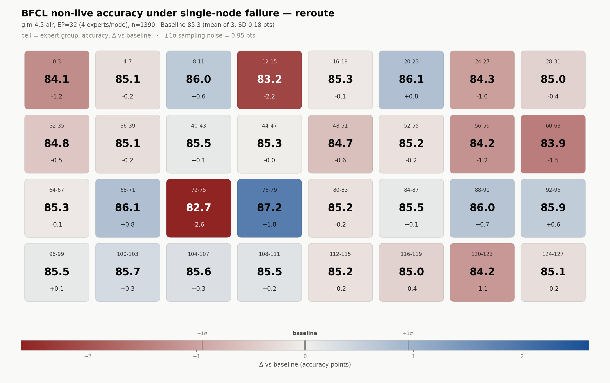

# GLM-4.5-Air on BFCL: EP-node-failure sweep

The same experiment as [README.md](./README.md) — lose one node out of 32 in an
expert-parallel deployment and measure the accuracy cost — run on
**GLM-4.5-Air** with **BFCL** (Berkeley Function-Calling Leaderboard) as the
benchmark, and only the `reroute` semantic.

Nothing about the mask itself changed. This document is only what is different.

## Why the mask needed no changes

| | Qwen3-30B-A3B | **GLM-4.5-Air** | Kimi-K2.6 |
|---|---|---|---|
| Routed experts | 128 | **128** | 384 |
| Per node (÷32) | 4 | **4** | 12 |
| Fraction dropped | 3.125% | **3.125%** | 3.125% |
| top-k | 8 | **8** | 8 |
| P(≥1 dead slot) | 22.4% | **22.4%** | 22.4% |
| MoE layers | 48 (all) | **45 (1–45)** | 60 (1–60) |
| Routing | `softmax` + `fused_topk` | **`sigmoid` + `grouped_topk` (`noaux_tc`)** | `sigmoid` + `grouped_topk` |
| Expert groups | none | **`n_group=1`, `topk_group=1`** | 8 groups, top-4 |
| Shared expert | none | **1 (replicated, unaffected)** | 1 |
| Size (bf16) | ~61 GB | **~214 GB** | ~1 TB |

GLM-4.5-Air lands in the intersection of the two models already supported:
Qwen3's expert count and block size, K2.6's routing implementation. Confirmed
against the checkpoint's `config.json` and against
`vllm/model_executor/models/glm4_moe.py:148-163`, which builds `FusedMoE` with
`use_grouped_topk=True`, `scoring_func="sigmoid"` and the gate's
`e_score_correction_bias` — so the bias **must** be masked alongside the logits,
which `expert_failure.py` already does for the K2.6 path. vLLM 0.10.0 supports
`Glm4MoeForCausalLM` natively; no upgrade, no `hf_overrides`, no custom model
code.

`num_nextn_predict_layers=1` means layer 46 in the checkpoint is an MTP head,
which vLLM does not load. Layer 0 is dense (`first_k_dense_replace=1`), so 45 of
the 46 layers are MoE and the global patch covers every one.

`tests/test_expert_failure.py` gained a third routing profile, `glm4.5-air`
(128 experts, `grouped_topk`, sigmoid, bias, 1 group), so every masking semantic
is verified on GLM's exact configuration: **57 tests passing**.

## Serving

GLM-4.5-Air is ~214 GB in bf16 and does **not** fit on one 183 GB B200, so
`--tensor-parallel-size 2`. That gives 4 independent shards on an 8-GPU box
rather than Qwen3's 8 — though see [Cost](#cost): sharding turns out to be
unnecessary.

```bash
MODEL=/sms-scratch/checkpoints/GLM-4.5-Air   # no trailing slash: vLLM matches served names exactly

CUDA_VISIBLE_DEVICES=0,1 python -m reap.expert_failure_server \
    --model $MODEL --tensor-parallel-size 2 --enable-expert-parallel \
    --max-model-len 32768 --max-num-seqs 32 --gpu-memory-utilization 0.90 \
    --trust-remote-code --port 8000 &
```

`--enforce-eager` is forced by the launcher — see the CUDA-graph section of the
main README. With graphs on, every masked cell silently scores like a baseline.

Preflight before spending time, exactly as on Qwen3:

```bash
python experiments/node-failure/sweep.py --model $MODEL --port 8000 --preflight-only
```

Measured on GLM-4.5-Air:

```
calls=4320.0 tokens=5310.0 dead_slot_rate=0.652 lost_gate_mass=0.616
node 0 (4/128 experts): dead_slot_rate=0.0840 (uniform-routing expectation 0.0312)
preflight PASSED
```

`calls=4320` is 45 MoE layers × forwards × 2 TP workers (counters are summed
across workers) — independent confirmation that the hook is on the hot path for
all 45 layers.

**Note the 0.0840.** Qwen3's node 0 measured 0.0344 against the same 0.0312
uniform expectation; GLM-4.5-Air's is **2.7×** the uniform rate. GLM's routing is
far more concentrated, so the per-node spread should be much wider than Qwen3's
— which makes *which* node dies matter more here, and makes the full 32-node
sweep worth more than it was on Qwen3.

## Running the sweep

```bash
python experiments/node-failure/sweep.py --model $MODEL --port 8000 \
    --benchmark bfcl --modes reroute --baseline-repeats 3 \
    --results-dir artifacts/glm-node-failure/bfcl
```

35 cells (32 nodes + 3 baselines). Results land in
`artifacts/glm-node-failure/bfcl/{baseline/rep_N,reroute/node_NN}/cell.json`; a
cell with a `cell.json` is skipped on restart, so an interrupted sweep resumes.
`--shard i --num-shards 4` splits it across four TP=2 servers if wanted.

`--modes reroute` is deliberate: `reroute` corresponds to a REAP structural
prune of the same 4 experts and is the upper bound on quality. `drop_renorm` and
`drop` remain available and tested.

## BFCL: how it is wired up

BFCL cannot be installed next to vLLM — it pins `numpy==1.26.4` against this
environment's numpy 2.x, and pulls in `mistralai`, `anthropic`, `cohere`,
`faiss-cpu` and `sentence-transformers`. Since BFCL is purely an HTTP client
against the OpenAI endpoint, it gets **its own interpreter**:

```bash
bash scripts/setup_bfcl.sh
```

That does the sparse submodule checkout, builds `.venv-bfcl`, installs
`bfcl_eval` plus `soundfile` (an undeclared transitive dep of `qwen-agent`, which
BFCL's registry imports at module load), and verifies the registry loads.
**[BFCL-RUNBOOK.md](./BFCL-RUNBOOK.md) is the how-to-run document** — this file
covers the experiment, not the mechanics.

| Path | Role |
|---|---|
| `third-party/gorilla/` | upstream BFCL, sparse checkout, **unmodified** |
| [`src/reap/bfcl.py`](../../src/reap/bfcl.py) | in-environment wrapper: build the command, run it, parse the summary, verify completeness |
| [`src/reap/bfcl_client/__main__.py`](../../src/reap/bfcl_client/__main__.py) | runs under `.venv-bfcl`: registers the model, calls BFCL's own generate+evaluate, writes `bfcl_summary.json` |
| [`src/reap/bfcl_client/handler.py`](../../src/reap/bfcl_client/handler.py) | the prompting-mode handler |

The model is registered **in-process** into `MODEL_CONFIG_MAPPING` rather than by
patching the vendored checkout, so `third-party/gorilla` stays a pristine
upstream tree that can be updated with a `git pull`.

`--skip-server-setup` plus `LOCAL_SERVER_ENDPOINT`/`LOCAL_SERVER_PORT` is what
points BFCL at the caller's masked server instead of letting it launch its own
unmasked vLLM. `BFCL_PROJECT_ROOT` is set per cell, which matters: BFCL skips
test entries that already have a result file, so a shared root would score a
masked cell against the baseline's cached generations.

### Prompting mode, and why

BFCL's own GLM entries are no use here: `glm-4.5-air-FC` points at Zhipu's cloud
API, and the local `glm-4-9b-chat` handler hard-codes that model's Chinese system
prompt and prompt format. So the handler here drives the model in **prompting
mode**: BFCL puts the function docs in the system prompt, the model answers with
`[func(arg=val)]` text, and BFCL's AST checker parses it. The prompt is built
from the checkpoint's own `chat_template.jinja` via
`tokenizer.apply_chat_template`, rather than transcribed into Python.

Prompting mode needs **nothing** from the server beyond `/v1/completions` — no
`--tool-call-parser glm4_moe`, no `--enable-auto-tool-choice`. That matters because
every server-side option is one more thing that has to be identical between the
baseline and all 32 masked cells. Scores sit below the leaderboard's
`glm-4.5-air-FC` row; that is expected and irrelevant, because what is measured
is the **delta** between an unmasked and a masked run of this exact
configuration.

Thinking is **off** (`enable_thinking=False`, which GLM's template renders as
`/nothink` plus a pre-filled `<think></think>`), matching what `reap.eval`
already does for GLM in the evalplus path. Verified on real output: completions
come back as clean `[func(...)]` with no reasoning leakage. Whatever the setting,
it must be identical across every cell — `--bfcl-enable-thinking` flips it.

### What gets measured

`non_live`, the 7-category V1 set, **1390 entries**:

| Category | n | Baseline |
|---|---|---|
| `simple_python` | 400 | 0.898 |
| `simple_java` | 100 | 0.660 |
| `simple_javascript` | 50 | 0.780 |
| `multiple` | 200 | 0.910 |
| `parallel` | 200 | 0.895 |
| `parallel_multiple` | 200 | 0.880 |
| `irrelevance` | 240 | 0.771 |
| **pooled** | **1390** | **0.853** |

The reported `score` is **entry-weighted** — pooled correct/total across
categories — not the leaderboard's unweighted category mean. Pooling is the right
choice for a sensitivity study: it is a single binomial proportion, so its noise
floor is computable. Per-category accuracies are recorded alongside it in
`cell.json`, because a routing perturbation need not hurt all seven equally.

### Statistical power at n=1390

At p ≈ 0.85, binomial SE is ~0.96 points — versus ~1.3 points for MATH-500 at
n=500. A 5%-relative drop is ~4.3 points, i.e. **~4.5σ**, so BFCL non-live can
answer the "within 5%?" question with more margin than MATH-500 did. A true 1–2%
relative effect is still ~1–2σ and will not separate from noise; the likely
outcome remains "no measurable change". `--baseline-repeats 3` measures the noise
floor rather than assuming it.

With 32 cells at this sensitivity, roughly 1-in-370 cells clears a 3σ bar by
chance; treat a single outlying node as noise unless it reproduces.

## Cost

BFCL non-live answers are a single function call — tens of output tokens against
a ~1.5k-token prompt — so the run is prefill-dominated and a 2×B200 chews through
1390 entries in about a minute even in eager mode. Measured: **~70 s per baseline
cell, ~1.7 min per masked cell**, so the full 35-cell matrix is **~50 minutes on
a single server** and sharding across the box is unnecessary. For comparison, one
MATH-500 cell on Qwen3-30B-A3B took 27.5 min.

## Results

Full 32-node `reroute` sweep, BFCL `non_live` (1390 entries), 3 baseline repeats.
`python experiments/node-failure/report.py artifacts/glm-node-failure/bfcl`:

```
baseline: mean 0.8535   0.8532  0.8554  0.8518
noise floor: binomial SE 0.95 pts, observed baseline SD 0.18 pts -> using 0.95 pts
acceptance bar: 5% relative = 4.27 pts = 4.5 sigma

mode         node   score   delta    rel%  sigma
reroute        18  0.8273   -2.61   -3.06   -2.8   <- worst
reroute         3  0.8317   -2.18   -2.56   -2.3
reroute        15  0.8388   -1.46   -1.71   -1.5
...
reroute        19  0.8719   +1.85   +2.16   +1.9   <- best
```

**No node exceeds the 5% bar.** The worst, node 18, is −3.06% relative (−2.8σ);
the best, node 19, is *+2.16%*.



```bash
python experiments/node-failure/heatmap.py artifacts/glm-node-failure/bfcl \
    --out fig/glm45-air-bfcl-node-failure --model glm-4.5-air
```

One cell per node, laid out in expert order, so the grid *is* the EP partition:
cell `k` is the contiguous block node `k` owns in all 45 MoE layers. Color encodes
the **delta**, diverging around the baseline with the ±1σ sampling floor marked on
the scale — so "did this node matter?" is answerable by eye. `--scale sequential`
gives a one-hue accuracy ramp instead (`-seq.png`), and both variants are written
in light and dark. `heatmap.py` also emits the same numbers as CSV, and asserts
every cell's value text clears 4.5:1 against its own fill rather than assuming it.

That the diverging scale is the default is not cosmetic. On the sequential
version 26 of the 32 cells land in the same mid-blue band and above-baseline is
indistinguishable from below — which is precisely the distinction this sweep
exists to show.

The distribution is what makes the result readable:

| | value |
|---|---|
| baseline mean (n=3) | 0.8535, SD **0.18 pts** |
| mean delta over 32 nodes | **−0.24 pts** (−0.28% relative) |
| SD of deltas | **0.89 pts** |
| range | −2.61 to **+1.85** pts |
| nodes below baseline | 20 / 32 |

The per-node SD (0.89 pts) matches the binomial SE at n=1390 (0.95 pts) almost
exactly, and the deltas straddle zero with a third of nodes scoring *above*
baseline. In other words the per-node scatter is sampling noise, not a per-node
effect: losing one node's four experts under `reroute` does not measurably move
BFCL non-live on GLM-4.5-Air.

There *is* a real aggregate effect, but it is tiny. Pooling all 32 cells, the
mean delta of −0.24 pts is −1.55σ on the standard error of that mean — a hint of
degradation, roughly **0.3% relative**, an order of magnitude inside the 5% bar
and undetectable in any single cell. This is the outcome PLAN.md predicted for a
3.125% expert loss on a model where ~50% pruning is near-lossless.

Two caveats on reading the table:

- **Node 18 and node 3 are not findings.** At 32 cells and ~1σ per cell, a −2.8σ
  outlier is expected roughly once per sweep. Rerun those two nodes before
  treating either as a real weak spot.
- **The per-node dead-slot rate is 0 by construction** under `reroute`, so the
  routing counters cannot explain the scatter here. To get the covariate that
  *does* explain which nodes carry the most traffic, run the same nodes under
  `--modes drop` — where `dead_slot_rate` and `lost_gate_mass_frac` are non-zero
  and measure exactly how much gate mass each node owns.

### Per category

`irrelevance` is by far the most volatile, and it is the reason node 18 and node
3 sit at the bottom:

| Category | baseline | masked mean | min | max | range |
|---|---|---|---|---|---|
| `irrelevance` | 0.771 | 0.773 | 0.675 | 0.821 | **14.6 pts** |
| `simple_javascript` | 0.807 | 0.781 | 0.740 | 0.820 | 8.0 pts |
| `multiple` | 0.910 | 0.907 | 0.860 | 0.925 | 6.5 pts |
| `simple_python` | 0.897 | 0.895 | 0.858 | 0.922 | 6.5 pts |
| `parallel_multiple` | 0.882 | 0.883 | 0.860 | 0.905 | 4.5 pts |
| `parallel` | 0.890 | 0.886 | 0.860 | 0.900 | 4.0 pts |
| `simple_java` | 0.657 | 0.654 | 0.630 | 0.670 | 4.0 pts |

Its masked *mean* (0.773) is level with baseline (0.771), so this is volatility
rather than damage — `irrelevance` is a 240-entry binary refuse/don't-refuse
decision, so it has both the smallest sample and the least margin. It is the
category to watch if a larger perturbation is ever tested.

Note `simple_javascript` is the only category whose masked mean sits a visible
distance below baseline (−2.6 pts), on just 50 entries — i.e. ~1 entry. Not a
signal at that n.

### Cost

The whole 35-cell matrix ran in **~50 minutes on one TP=2 server**: ~70 s per
baseline cell and ~1.7 min per masked cell (the mask's per-layer `.item()`
syncs cost roughly 2x). No sharding needed.

## Verification done

- **57/57 tests** in `tests/test_expert_failure.py`, including the new
  `glm4.5-air` routing profile on every masking semantic.
- **Preflight passed on the live GLM-4.5-Air server**: hook invoked
  (`calls=4320`), realized dead-slot rate matches the topology, masking changes
  generation.
- **BFCL end-to-end against the live server.** A 50-entry `simple_javascript`
  smoke run scored 0.78 and its failures were inspected: genuine AST/semantic
  errors, not format or thinking-tag artifacts.
- **A real baseline and a real masked cell.** Baseline 0.8532 and
  `reroute`/node-0 0.8410, both over the full 1390 entries. The masked cell
  recorded `calls=167760` (45 layers × 2 workers × forwards) with `dead_slots=0`
  — exactly right for `reroute`, which masks before selection so a dead expert is
  never chosen. The baseline recorded `calls=0`, confirming the hook
  short-circuits when idle and costs the baseline nothing.
- A cell is recorded only after its score is read back off disk and its entry
  count checked against 1390 (`--expect-n 0` to disable).

## Fidelity limits, additional to the main README's

- **GLM-4.5-Air has a shared expert** (`n_shared_experts=1`), replicated per node
  and surviving a node loss, giving it a floor of always-available capacity that
  Qwen3 lacks. It should therefore *under*-state the damage relative to Qwen3 —
  and it matches K2.6, which also has one.
- **Prompting mode is not the deployed configuration.** A real GLM-4.5-Air
  function-calling deployment would use native tool calls. The delta measured
  here is the delta for prompting mode; if the acceptance criterion is about an
  FC deployment, re-run with `--tool-call-parser glm4_moe` and an FC handler.
- Routing concentration (`dead_slot_rate` 0.084 vs 0.031 uniform on node 0) means
  the uniform-contiguous-partitioning assumption bites harder here than on
  Qwen3. A deployment using EPLB or any load-balanced placement would see a
  materially different — and probably more forgiving — per-node picture.
