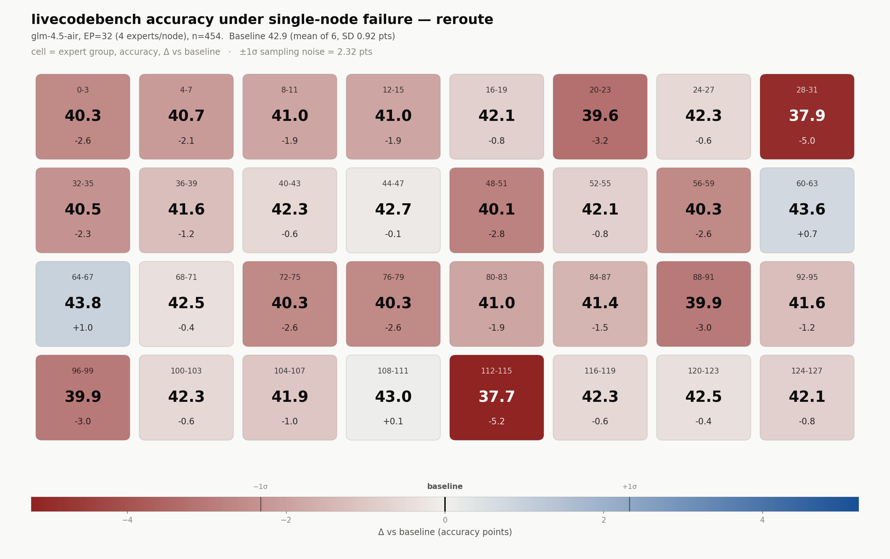

# GLM-4.5-Air on LiveCodeBench: EP-node-failure sweep

The same experiment as [README.md](./README.md) — lose one node out of 32 in an
expert-parallel deployment and measure the accuracy cost — run on
**GLM-4.5-Air** with **LiveCodeBench** code generation as the benchmark, and
only the `reroute` semantic. It is the third benchmark on this sweep, after
MATH-500 (Qwen3-30B-A3B) and [BFCL](./GLM45-AIR-BFCL.md) (GLM-4.5-Air).

Nothing about the mask changed. Nothing about the model changed — it is the same
checkpoint, the same server flags, and the same measured node-0 dead-slot rate
(0.0840) as the BFCL sweep. This document is what is different, which turns out
to be almost entirely **statistical**: LiveCodeBench is far noisier than BFCL,
in a way that invalidates the analysis the BFCL sweep used and forces a paired
one.

**[LCB-RUNBOOK.md](./LCB-RUNBOOK.md) is the how-to-run document** — this file
covers the experiment.

## Reproducing this result

Start to finish on one 8×B200 box, ~6 hours. Everything is resumable: a cell
with a `cell.json` is skipped, so any step can be re-run after an interruption.

**0. Prerequisites.** No LiveCodeBench-specific setup — `lcb_runner` is the
`third-party/LiveCodeBench` submodule and already an editable dependency.

```bash
git submodule update --init third-party/LiveCodeBench
uv pip install -e .                    # registers the vllm.general_plugins hook
.venv/bin/python -m pytest tests/test_expert_failure.py -q      # expect 80 passed
```

The last one matters: it verifies the routing mask on GLM-4.5-Air's exact
routing profile *and* the paired statistics, without needing a GPU or a
checkpoint.

**1. Check the box is yours.** All 8 GPUs must be free — GLM-4.5-Air is ~214 GB
and needs TP=2, so 4 servers fill the box.

```bash
nvidia-smi --query-compute-apps=pid,used_memory --format=csv
```

**2. Run the sweep.** One command; it starts the servers, preflights each, and
shards the 35 cells across them.

```bash
MODEL=/sms-scratch/checkpoints/GLM-4.5-Air TP=2 BENCHMARK=livecodebench \
MODES=reroute BASELINE_REPEATS=6 \
RESULTS=artifacts/glm-node-failure/livecodebench \
    bash experiments/node-failure/launch_sweep.sh
```

No trailing slash on `MODEL` — vLLM matches served names literally, and a
trailing slash 404s every request. `BASELINE_REPEATS=6` is deliberate: this
benchmark's noise floor is the thing that decides what the sweep can conclude,
and 3 repeats measure it too coarsely (see below).

Follow it with:

```bash
tail -f artifacts/glm-node-failure/livecodebench/logs/sweep_shard0.log
find artifacts/glm-node-failure/livecodebench -name cell.json | wc -l   # of 38
```

Two log patterns are **benign** and appear in every run: `TimeoutException` from
`testing_util.timeout_handler` (LCB's per-test alarm while grading a slow
program, caught per-problem) and `RuntimeError: Event loop is closed` from
httpx (a client being garbage-collected after `asyncio.run` closed its loop).
Neither is a failure. Real failures say `empty generation`, `scored N problems`,
or `no healthy vLLM server`.

**3. Confirm every cell is comparable** before reading any number. A cell that
scored fewer problems, or that hit a server hiccup, is not comparable to the
baseline:

```bash
python - <<'EOF'
import json, glob
for f in sorted(glob.glob('artifacts/glm-node-failure/livecodebench/*/*/cell.json')):
    d = json.load(open(f)); b = d[d['benchmark']]
    s = json.load(open(f.replace('cell.json', 'lcb_summary.json')))
    assert b['num'] == 454, (f, b['num'])
    assert s['failed_requests'] == 0, (f, s['failed_requests'])
    assert d['mode'] == 'off' or d['routing']['calls'], f"{f}: mask never fired"
print("all cells complete, no dead requests, hook live in every masked cell")
EOF
```

The third assertion is the one that matters most: a masked cell whose routing
hook never fired is silently a baseline, which would show up as "no
degradation".

**4. Analyse.** The paired script is the one to read; `report.py` is kept for
continuity with the other benchmarks but cannot resolve this benchmark's bar.

```bash
python experiments/node-failure/lcb_paired.py artifacts/glm-node-failure/livecodebench \
    --csv fig/glm45-air-lcb-node-failure-paired.csv
python experiments/node-failure/report.py artifacts/glm-node-failure/livecodebench
python experiments/node-failure/heatmap.py artifacts/glm-node-failure/livecodebench \
    --out fig/glm45-air-lcb-node-failure --model glm-4.5-air
```

**5. Shut down.** The launcher leaves 4 servers holding all 8 GPUs:

```bash
pkill -f "reap[.]expert_failure_server"
nvidia-smi --query-gpu=index,memory.used --format=csv,noheader   # expect 0 MiB
```

### What will and will not reproduce

**Will:** the aggregate. −6σ pooled, ~29/32 nodes below the null, a mean near
−1.6 pts. This was stable across every recount from 12 cells onward and across
both the 3- and 6-baseline analyses.

**Will not:** the per-node ordering. With ~24% of problems flipping between
identical unmasked runs, individual node deltas are mostly measurement noise —
node 7 and node 28 being the two worst is the one per-node claim worth
re-testing, and it is *not* established at Bonferroni strength here.

**Do not change mid-sweep:** `--lcb-start-date`/`--lcb-end-date` (they set which
problems are scored), `--lcb-max-tokens`, `--lcb-enable-thinking`, or
`--max-model-len`. A cell is only comparable to a baseline that saw the same
problems under the same limits.

## How LCB is wired up

Unlike BFCL, LiveCodeBench needs **no second virtualenv** — `lcb_runner` is the
vendored `third-party/LiveCodeBench` submodule and already an editable
dependency, so the run happens in this interpreter with no subprocess.
`zai-org/GLM-4.5-Air` was already registered in its `LanguageModelStore` as
`LMStyle.ReapBase`, which selects `VLLMServerRunner` — chat completions against
the caller's server, with the chat template applied server-side.

| Path | Role |
|---|---|
| `third-party/LiveCodeBench/` | upstream fork, **unmodified** |
| [`src/reap/lcb.py`](../../src/reap/lcb.py) | in-environment wrapper: bound the concurrency, run it, parse the metrics, verify completeness |
| [`experiments/node-failure/lcb_paired.py`](./lcb_paired.py) | the paired per-problem analysis this benchmark needs |

`src/reap/eval.py`'s LCB path was already there but hardcoded its parameters,
ran at temperature 0.2, and swallowed every exception — so a benchmark that
never ran looked exactly like one that scored well. It now takes `lcb_*` from
`EvalArgs`, runs greedy when `greedy=True`, and honours `strict`.

### Two things the wrapper exists for

**Bounded concurrency.** Upstream's `VLLMServerRunner.run_batch` fires *every*
prompt at once through `asyncio.gather`. With 454 problems that leaves ~420
requests queued in vLLM while their client-side 1800 s timeout counts down — and
`make_auto_request` retries forever on a timeout, so a slow cell becomes a retry
storm. Masked cells are exactly the ones that generate to `max_tokens`, so this
is the failure mode a *failure* sweep would hit first. `reap.lcb` replaces
`run_batch` with a semaphore-bounded version (`--lcb-num-threads`, default 32,
matched to `--max-num-seqs`). Throughput is unchanged; per-request latency is
bounded.

**Telling a dead request from a bad answer.** LCB grades by execution, so an
empty response scores as a wrong answer — indistinguishable, in pass@1, from a
model that answered badly. The two are counted separately:

- `failed_requests` — the response came back empty. A *server* failure depressing
  the score of whichever cell hit it. `verify_lcb_summary` rejects the cell.
- `no_code_extracted` — a non-empty answer with no fenced code block. A genuine
  model failure and a legitimate zero, and a plausible degradation mode under a
  mask, so it is recorded rather than rejected.

Across this sweep, `failed_requests` was **0** in every cell.

### What gets measured

Code generation pass@1 over the **2024-08-01 → 2025-07-31** contest window of
`release_latest`: **454 problems** (the LCB v5+v6 window). Greedy, `n=1`,
`max_tokens=16384`, thinking off — the same "off" as the BFCL sweep.

The window is a deliberate choice. The repo's historical LCB call used
2025-01-01 onwards, which is only 182 problems; at that size the binomial SE
(~3.7 pts) is larger than the 5%-relative bar (~2.2 pts) and the sweep could
conclude nothing. 454 halves it. The pinned dataset ends 2025-04, so the
end date is not binding.

Baseline difficulty split, which matters for reading the result — the benchmark
is dominated by problems the model almost never solves:

| Difficulty | n | Baseline pass@1 |
|---|---|---|
| easy | 110 | ~0.92 |
| medium | 141 | ~0.48 |
| hard | 203 | ~0.12 |
| **pooled** | **454** | **~0.43** |

### ~9% of answers are truncations, in every cell

41–53 answers per cell carry no fenced code block. They are not refusals: every
one has exactly one ``` marker and runs 31k–78k characters against a ~4k median
for a successful answer. The model talks itself out of its 16384-token budget
mid-code-block, on hard (31) and medium (10) problems.

This is left as is. It depresses the absolute score, but it is configured
identically in every cell, and `no_code_extracted` is recorded per cell so the
"masking makes it ramble more" hypothesis is checkable rather than assumed —
measured, it does not (baselines 42/41/53, masked cells in the same band).
Raising `--lcb-max-tokens` mid-sweep would have broken comparability, which is
worth more than a higher absolute number.

## Why this benchmark needed a different analysis

This is the finding that matters most, and it is about the measurement rather
than the model.

**LiveCodeBench pass@1 is not reproducible run to run, even at temperature 0.**
Three unmasked baseline repeats of the identical configuration scored:

```
rep_0  0.4141 (188/454)
rep_1  0.4405 (200/454)
rep_2  0.4317 (196/454)
```

SD **1.35 points**, and a 2.6-point spread between the extremes — against a
5%-relative bar of ~2.2 points. For comparison, BFCL's three baselines had an SD
of **0.18** points. The bar is *inside* the noise, so the unpaired
"score minus baseline mean" comparison that carried the BFCL sweep cannot answer
the question here at all.

The cause is not sampling: decoding is greedy. It is that vLLM's batch
composition varies between runs, that perturbs a few tokens through
non-associative floating-point reductions, and in code generation a single token
flips an entire program between passing and failing. Measured directly: **75 of
454 problems (16.5%) flip verdict between unmasked runs**, and any two baselines
disagree on ~50 problems.

That same fact is what makes the question tractable, once the analysis is paired.
Nearly every problem gives the same verdict in both runs; the pooled difference
is a small residue of flips in each direction. So
[`lcb_paired.py`](./lcb_paired.py) compares *which problems* changed:

- `fail_to_pass` / `pass_to_fail` against a majority-vote baseline reference, so
  the reference does not carry one single run's flip noise.
- Net delta with a **McNemar** standard error — `sqrt(discordant)` problems —
  which depends on the discordant count rather than on the variance of two
  whole-benchmark proportions, and is several times smaller.
- A two-sided **exact** binomial p-value on the discordant pairs. The
  chi-square approximation is not safe at these counts.
- A **leave-one-out empirical null**: each baseline repeat scored against the
  majority of the *others*, holding it out so the reference cannot agree with it
  by construction. This is what a node that does nothing actually reads, and
  every per-node row is judged against that band rather than against zero.

The statistics are unit-tested (`tests/test_expert_failure.py`), because the
conclusion now rests on them.

## Results

Full 32-node `reroute` sweep, 454 problems per cell, **6** baseline repeats.
Every cell scored all 454 problems with zero failed requests and a live routing
hook (`calls` in the millions, `num_dead=4`, `mask_consistent`).

Baselines, unmasked, identical configuration:

```
0.4141  0.4405  0.4317  0.4229  0.4295  0.4339      mean 0.4288, SD 0.92 pts
```

**The headline: a real aggregate effect, inside the 5% bar.**

| | value |
|---|---|
| mean per-node delta | **−1.63 pts** = **−3.9% relative** |
| SD across nodes | 1.48 pts |
| pooled, null-corrected | **−227 problems of 1400 discordant = −6.08σ** |
| nodes below the null | **29 / 32** |
| worst | node 28 −5.76 pts (p=0.015), node 7 −4.84 pts (p=0.044) |
| best | node 15 +0.88 pts, node 16 +0.42 pts |



One cell per node, laid out in expert order, so the grid *is* the EP partition:
cell `k` is the contiguous block node `k` owns in all 45 MoE layers. The picture
is overwhelmingly red with three faintly blue cells, which is the result in one
image: a distribution shifted slightly negative, not a cliff.

This is **the first of the three benchmarks to show a measurable aggregate
effect.** On the same model, the same mask and the same `reroute` semantic, BFCL
gave −0.28% relative (−1.55σ, indistinguishable from noise). LiveCodeBench gives
−3.9% at −6.1σ. Code generation needs a long chain of exactly-right tokens where
emitting one function call does not, so it is the more sensitive instrument — and
it says that losing 4 of 128 experts does cost something real, while still
staying under a 5% acceptance bar.

### No single node is the problem

Nodes 28 and 7 are the tail: −5.76 and −4.84 points, p = 0.015 and 0.044. Neither
clears the Bonferroni level for 32 tests (p < 0.0016), so **on the statistics
alone neither is a per-node finding** — two cells near p ≈ 0.03 out of 32 is
close to what chance produces.

What makes them worth naming anyway is that they fail *differently*, not just
more. Node 28's error profile against a baseline repeat:

| | node 28 | baseline |
|---|---|---|
| Runtime Error | **42** | 10 |
| truncated (`expected an indented block`) | 50 | 37 |
| Time Limit Exceeded | 26 | 13 |
| Wrong Answer | 58 | 62 |

A 4× spike in crashes with wrong answers *flat*. Node 7 shows the same shape (35
runtime errors). Two independent cells sharing both the magnitude and an unusual
mechanism is stronger evidence than either p-value, and it is the one result here
that would justify a confirming re-run.

### The mechanism is truncation, not wrong logic

Averaged over all 32 masked cells against the 6 baselines:

| channel | baseline | masked | Δ |
|---|---|---|---|
| **pass** | 194.7 | 187.3 | **−7.3** |
| truncated (ran past `max_tokens`) | 41.3 | 48.9 | **+7.5** |
| other | 7.7 | 12.1 | +4.4 |
| runtime error | 10.3 | 11.3 | +0.9 |
| time limit | 20.0 | 19.4 | −0.6 |
| wrong answer | 180.0 | 175.0 | **−5.0** |

Losing a node does not make the model answer *wrong* — plain wrong answers go
**down**. It makes the model ramble past its 16384-token budget, and a truncated
answer is an automatic failure. The +7.5 truncations account almost exactly for
the −7.3 lost passes.

That carries a caveat for the headline number: **the measured −3.9% is partly a
property of the token ceiling**, so a larger `--lcb-max-tokens` would likely
shrink it. Anyone quoting this figure should quote the ceiling with it. It also
suggests the more useful follow-up is not more nodes but the same sweep at
`--lcb-max-tokens 32768`, which would separate "the model got worse at coding"
from "the model got wordier".

### Reading the numbers: why they are paired

The unpaired `report.py` view flags "11 cells exceed the 5% bar". **Ignore that
line.** Its own noise floor (binomial SE 2.32 pts) is larger than the bar it is
testing against (2.14 pts), so per-cell verdicts there carry no information. It
is kept only for continuity with the other two benchmarks.

The numbers above come from `lcb_paired.py`, and three corrections inside it are
load-bearing:

1. **Paired, not pooled.** 108 of 437 problems (24.7%) flip verdict between
   unmasked runs; any two baselines disagree on ~37. The signal is which
   problems changed, not the difference of two rates.
2. **Ties excluded.** With an even number of repeats a 3–3 problem has no
   majority verdict. Resolving it to *fail* — which a naive `sum * 2 > len` does
   — pushed the reference to 0.3987, below every individual run, flattering
   every masked cell against it. 17 tied problems are dropped, leaving n = 437.
3. **Null-corrected.** Majority voting sharpens toward the likelier verdict, so
   a single run against a majority reference is not centred on zero: on problems
   the model passes less than half the time the majority says fail while a
   single run passes some. Measured on unmasked cells, that offset is **+5.2
   problems** at 6 repeats (it was ~0 at 3). Every net above has it subtracted.

The result is robust to these choices: at 3 baselines with no correction the
answer was −1.69 pts and −5.93σ, against −1.63 pts and −6.08σ here.

## Cost

A LiveCodeBench cell is decode-dominated — 454 problems at up to 16384 tokens
each, plus local grading that executes every generated program — so it costs
**~45 minutes per cell** on a 2×B200 server in eager mode, versus ~1.7 minutes
for a BFCL cell. Sharding is therefore *not* optional as it was for BFCL: 35
cells is ~26 GPU-hours of server time, run as 4 TP=2 shards in ~6 hours wall
clock.
